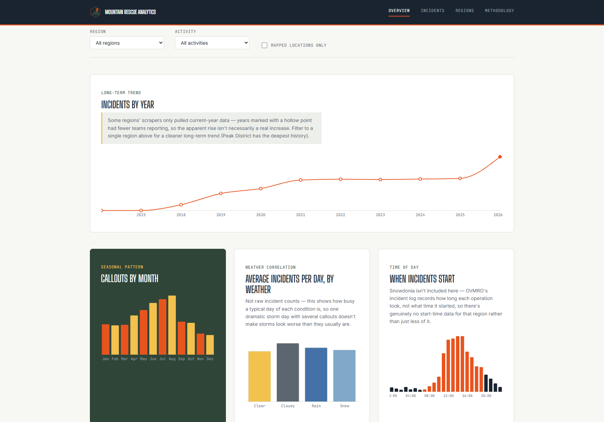
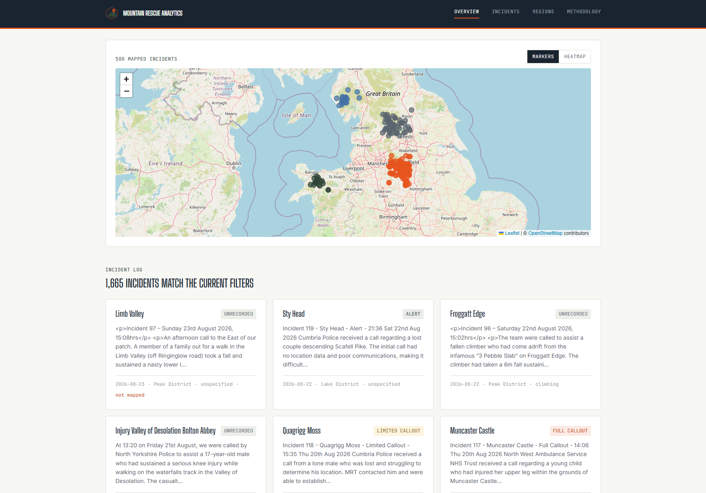
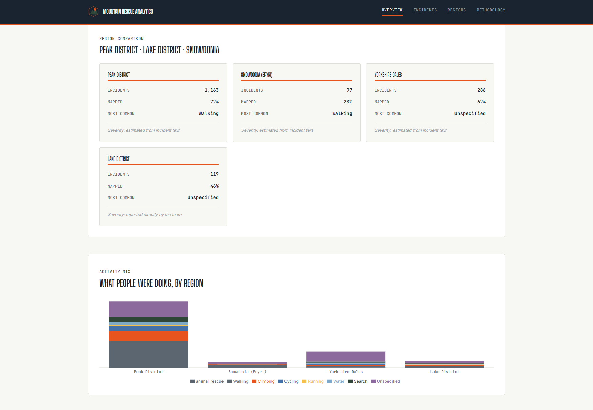

# UK Mountain Rescue Incident Analytics

[](https://react.dev/)
[](https://vitejs.dev/)
[](https://fastapi.tiangolo.com/)
[](https://www.python.org/)
[](https://www.sqlite.org/)
[](https://pandera.readthedocs.io/)
[](https://leafletjs.com/)
[](https://recharts.org/)
[](#)
[](https://vercel.com/)
[](https://render.com/)

**[Live site](https://mountain-rescue-analytics.vercel.app)** · **[API docs](https://mountain-rescue-analytics-api.onrender.com/docs)**
<!-- TODO: double check the live site link once the Vercel deploy's settled — using the default Vercel naming pattern here as a placeholder, API link is confirmed working -->

A dashboard that takes real, publicly available UK mountain rescue callout data and turns it into something you can actually explore — where incidents happen, when, what kind, how the weather and the light played into it, and how three genuinely different bits of British upland terrain compare to each other.

I built this as the analytics companion to my [UK Summit Guides](../uk-summit-guides) and [SummitLog UK](../summitlog-uk) projects, but it stands on its own. The other two are about planning a trip and logging one. This one is about what happens when a trip goes wrong, at a national scale, and what the numbers actually say about it.

## Screenshots

<!-- TODO: grab and drop these in before this goes properly live —
     - overview: hero + the seasonal/weather charts together
     - map: both marker and heatmap views
     - regions: the region comparison panel + activity mix
     maybe a mobile shot too if I remember. Same filenames below, just add the images to docs/screenshots/ -->


*Overview — hero, seasonal pattern, and weather correlation*


*Incident map — marker and heatmap views*


*Region comparison and activity mix*

## Why this exists

Most of my other analytics work (see [Ascent Analytics](../ascent-analytics)) uses synthetic data, because it's the sensible way to build a polished BI project without wrestling with a live API or a badly-formatted government CSV. This project is the opposite on purpose. Mountain rescue incident data is real, it's public, and it's genuinely messy — inconsistent date formats, free-text location descriptions instead of coordinates, categories that drift depending on who filled in the report, and three teams who each publish their callouts in a completely different shape. Cleaning that properly, and being honest in the docs about the judgement calls involved, is a big part of what this project is actually demonstrating.

It also turned into a decent stress test for a scraping pipeline: three real sites, three different structures, and more than a few genuine bugs along the way that only real data ever surfaced — a date parser picking up a stray year from deep in a narrative, a non-breaking space silently breaking a regex, a geocoding library expecting a completely different coordinate shape than the one I gave it. The commit history is the honest version of finding and fixing all of that, not a tidied-up highlight reel.

## What it does

- Scrapes incident logs from three UK mountain rescue teams — Edale (Peak District), Wasdale (Lake District), and Ogwen Valley (Snowdonia) — each with a different site structure, and cleans the results into one consistent schema
- Geocodes free-text locations so incidents can be plotted on a map, and pulls terrain elevation for every one of them
- Joins in historical weather (temperature, rain, wind, condition, sunrise/sunset) and UK bank holiday data for the date of each incident
- Tests a few real hypotheses against the data rather than just charting it for its own sake — does bad weather actually correlate with more callouts, does darkness, do bank holidays, does the day of the week — including checking one specific safety claim a team made in their own published incident log
- Serves everything through a small FastAPI service, with a React front end to explore it: filters, an interactive map (with a marker/heatmap toggle), and a dozen-plus charts covering seasonal trends, long-term year-on-year patterns, region comparisons, activity mix, and more
- Documents its own data quality throughout — what was inferred versus stated by the source, what was dropped and why, and where a source simply doesn't have a piece of data at all (rather than pretending it does)

## Tech stack

**Pipeline:** Python, pandas, pandera (schema validation), pytest, BeautifulSoup
**Backend:** FastAPI, SQLite
**Frontend:** React, Vite, Leaflet + leaflet.heat (mapping), Recharts (charts)
**Data sources:** Edale MRT, Wasdale MRT, and Ogwen Valley MRO's own published incident logs; Open-Meteo (historical weather, sunrise/sunset, elevation); gov.uk (UK bank holidays); OpenStreetMap/Nominatim (geocoding)

## Project structure

```
mountain-rescue-analytics/
├── pipeline/
│   ├── ingest/          # scrapers — one per team, since each site is structured differently
│   ├── clean/           # standardises dates, locations, categories into one schema
│   ├── validate/        # pandera schema checks, run before anything downstream trusts the data
│   ├── weather/         # historical weather + sunrise/sunset, joined per region and date
│   ├── geocode/         # location text -> coordinates, via Nominatim
│   ├── elevation/       # coordinates -> terrain elevation, via Open-Meteo
│   ├── holidays/        # UK bank holiday / day-of-week / weekend flags
│   ├── warehouse/       # builds the final SQLite database
│   ├── diagnostics/     # standalone scripts for debugging a source directly, without the full pipeline
│   ├── tests/
│   └── data/            # gitignored — regenerated by running the pipeline
├── api/                 # FastAPI service serving the cleaned data
│   └── tests/
├── src/
│   ├── styles/tokens/   # colour, type, spacing, motion — split by concern
│   ├── assets/brand/    # logo and other brand assets
│   ├── api/             # frontend's own API client
│   └── components/
│       ├── layout/, charts/, map/, filters/, incidents/, regions/
└── docs/                # data dictionary, methodology notes, lessons learned
```

## Getting set up

You'll need Node 18+ and Python 3.11+ on your machine.

**1. Clone it and install the front end**

```bash
git clone https://github.com/TGOSS1984/mountain-rescue-analytics.git
cd mountain-rescue-analytics
npm install
```

**2. Set up the pipeline**

```bash
cd pipeline
python -m venv .venv
source .venv/bin/activate   # on Windows: .venv\Scripts\activate
pip install -r requirements.txt
```

**3. Run the pipeline to build the local dataset**

```bash
python run_pipeline.py
```

This is an 8-step chain: scrape, clean, validate, join weather, geocode, fetch elevation, fetch bank holidays, then build the SQLite warehouse. It takes a while the first time, mostly because of Nominatim's rate limit during geocoding (roughly one request per second, and there are a lot of unique locations) — after that, results are cached and re-runs are quick. If you've already scraped and just want to re-run the later steps, `python run_pipeline.py --skip-scrape` skips straight to cleaning.

**4. Start the API**

```bash
cd api
pip install -r requirements-dev.txt
uvicorn main:app --reload
```

**5. Start the front end**

```bash
npm run dev
```

Then open `http://localhost:5173`.

## Deployment

This deploys as two separate services — a static frontend and an API — not one combined app, since that's the natural split for a React SPA plus a Python backend and keeps each side on the hosting platform it's actually suited to.

**API → [Render](https://render.com)**

The repo includes `render.yaml` for one-click infrastructure-as-code deployment: connect the repo in Render's dashboard, it reads the blueprint automatically (Python runtime, `api/` as the root directory, correct build/start commands already set). The one thing to configure manually afterwards is the `ALLOWED_ORIGINS` environment variable — set it to the real deployed frontend URL once that exists, comma-separated if there's more than one. Without it, CORS defaults to `localhost` only, which is safe but means the deployed frontend can't reach the API until it's set.

The SQLite database (`pipeline/data/processed/incidents.db`) is committed to the repo rather than regenerated on deploy — Render's free tier wipes the filesystem on every deploy, and re-running geocoding against Nominatim's rate limit on every single deploy would be both slow and an unreasonable load on a free service. Rebuild it locally with `python run_pipeline.py` and commit the result whenever the dataset needs refreshing.

**Frontend → [Vercel](https://vercel.com)**

Zero-config — Vercel auto-detects the Vite project and gets the build command and output directory right without any extra file. The only setup step is adding `VITE_API_BASE` under Settings → Environment Variables, pointing at the deployed Render API's URL. See `.env.example` for the local-dev equivalent.

## Keeping the data fresh

Left alone, the dataset is a static snapshot from whenever the pipeline was last run — it doesn't update itself. There's a scheduled GitHub Actions workflow (`.github/workflows/monthly-rescrape.yml`) that fixes that: it runs the full pipeline against the live sites on the 1st of every month, and if anything actually changed, commits the refreshed database straight back to `main`. Render's already set to auto-deploy on push, so that one commit is the whole loop — no manual step needed once it's running.

One-time setup needed before this actually works: the geocode and elevation lookup caches (`pipeline/data/interim/geocode_cache.json` and `elevation_cache.json`) need to exist in the repo already, or every monthly run would re-resolve every location from scratch against Nominatim's rate limit rather than just the new ones. If they're not already committed:

```bash
git add pipeline/data/interim/geocode_cache.json pipeline/data/interim/elevation_cache.json
git commit -m "chore: commit geocode/elevation caches for scheduled refresh"
git push
```

Can also be triggered manually any time from the Actions tab on GitHub (`workflow_dispatch`), useful for testing it or forcing a refresh outside the normal schedule.

## A note on the data

This project uses publicly published incident summary data. It doesn't include any personal or identifying information about anyone involved in a real callout — nothing here is about specific individuals, and the geocoding is deliberately kept at a level of precision (nearest named feature, not exact coordinates) that reflects how the source data itself is published.

You'll notice Scotland isn't in here, despite Cairngorm, Lochaber, and Glencoe being some of the busiest and best-known mountain rescue teams in the country. That's a deliberate choice, not an oversight — I checked, and unlike the England/Wales teams in this project, the classic Highland teams don't publish a structured incident log on their own websites; their callout detail lives on social media instead, which is a genuinely different (and much less reliable) thing to build a scraping pipeline against. The full reasoning is in `docs/data-dictionary.md`.

Where I've had to make a judgement call about how to categorise, clean, or fill a gap in the data, I've written it down in `docs/data-dictionary.md` rather than just quietly deciding for you.

## Status

This is an active portfolio project, built in public, one small commit at a time rather than one big drop. The commit history is the honest version of how it came together — including the bugs that only showed up against real data, and how they got fixed.

## License

MIT — see LICENSE.